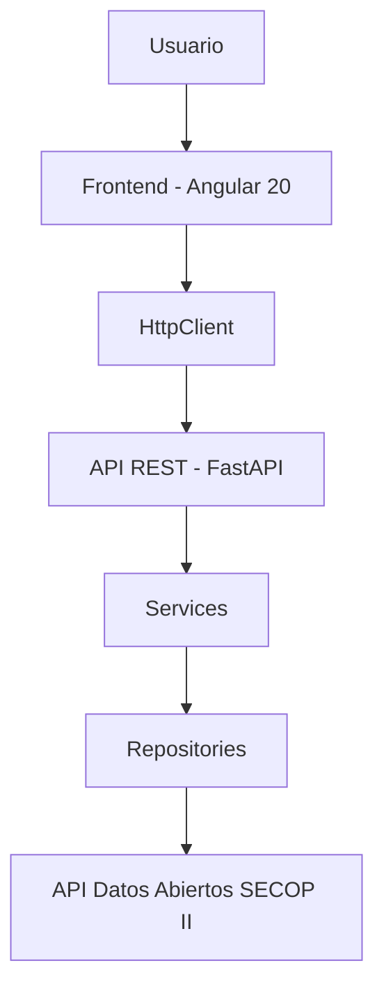
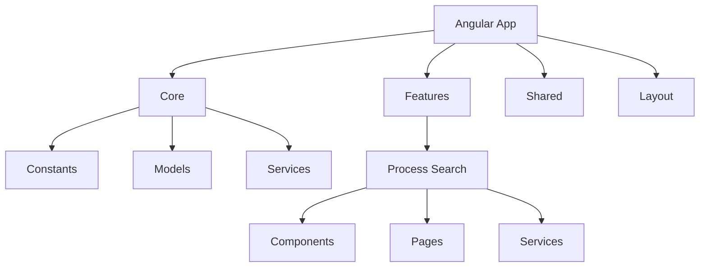
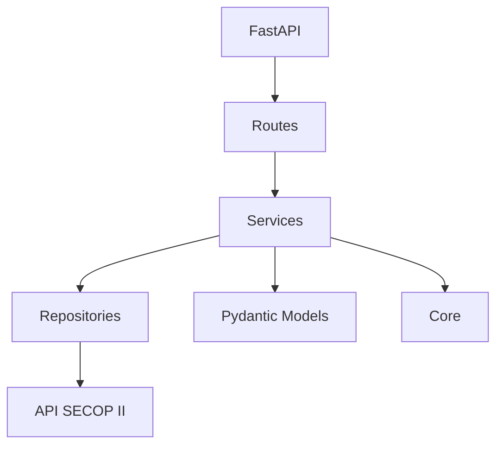
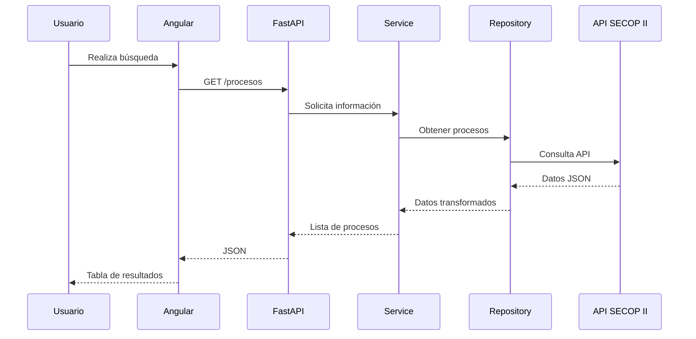
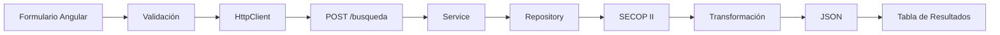
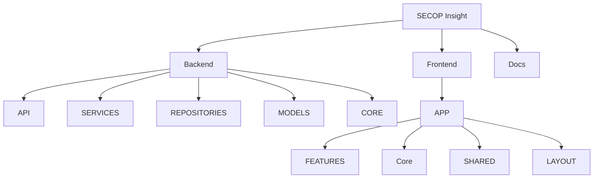
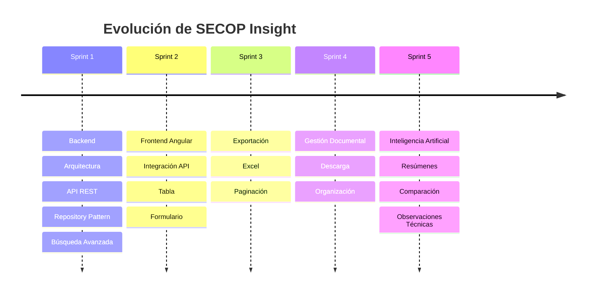

# Arquitectura Funcional - SECOP Insight

## Objetivo

Desarrollar una plataforma web que permita consultar, analizar y realizar seguimiento a los procesos de contratación publicados en **SECOP II**, mediante filtros avanzados, una interfaz moderna y escalable, generación de reportes y futuras capacidades de análisis documental e Inteligencia Artificial.

El proyecto integra un **backend desarrollado en FastAPI** y un **frontend desarrollado en Angular 20**, proporcionando una solución desacoplada, escalable y mantenible para la consulta de información pública de contratación estatal.

---

# Arquitectura del sistema

SECOP Insight implementa una arquitectura multicapa que desacopla la presentación, la lógica de negocio y el acceso a los datos.

```text
                    Usuario
                       │
                       ▼
                Angular 20
                       │
                 HttpClient
                       │
                       ▼
                FastAPI (API)
                       │
                       ▼
                  Services
                       │
                       ▼
               Repositories
                       │
                       ▼
      API Datos Abiertos SECOP II
```

---

# Arquitectura del Frontend

El frontend se desarrolla bajo una arquitectura basada en **Features**, utilizando componentes **Standalone** y separando claramente las responsabilidades de cada módulo.

```text
frontend/
└── src/
    └── app/
        ├── core/
        │   ├── constants/
        │   ├── models/
        │   └── services/
        │
        ├── features/
        │   └── process-search/
        │       ├── components/
        │       ├── pages/
        │       └── services/
        │
        ├── layout/
        └── shared/
```

### Core

Contiene los recursos reutilizables de toda la aplicación.

- Constantes.
- Modelos.
- Configuración.
- Servicios compartidos.

### Features

Agrupa la funcionalidad por dominio del negocio.

Actualmente:

- Process Search.

### Layout

Define la estructura principal de la aplicación.

- Header.
- Sidebar.
- Contenedor principal.

### Shared

Componentes reutilizables entre diferentes módulos.

---

# Arquitectura del Backend

El backend sigue una arquitectura por capas basada en separación de responsabilidades.

## API

Expone los endpoints REST y recibe las solicitudes HTTP.

## Services

Implementa la lógica de negocio del sistema.

## Repositories

Gestiona la comunicación con la API pública de Datos Abiertos de SECOP II.

## Models

Define los modelos internos mediante Pydantic.

## Core

Centraliza la configuración y variables de entorno.

---

# Flujo funcional

```text
Usuario

   │

Realiza búsqueda

   │

Angular

   │

HttpClient

   │

FastAPI

   │

Service

   │

Repository

   │

API Datos Abiertos SECOP II

   │

Transformación de datos

   │

Respuesta JSON

   │

Angular

   │

Tabla de resultados
```

---

# Módulos del sistema

## Módulo 1 - Consulta de procesos

Permite consultar procesos de contratación publicados en SECOP II utilizando diferentes criterios de búsqueda.

### Funcionalidades implementadas

| Funcionalidad | Estado |
|--------------|--------|
| Consulta de procesos | ✅ Implementado |
| Búsqueda por palabra clave | ✅ Implementado |
| Filtro por estado | ✅ Implementado |
| Filtro por modalidad | ✅ Implementado |
| Fecha de publicación | ✅ Implementado |
| Fecha de presentación de ofertas | ✅ Implementado |
| Catálogos dinámicos | ✅ Implementado |
| Consumo de API desde Angular | ✅ Implementado |
| Visualización de resultados | ✅ Implementado |

### Funcionalidades planificadas

| Funcionalidad | Estado |
|--------------|--------|
| Datos de la entidad | 🔜 Planeado |
| Número del proceso | 🔜 Planeado |
| Código UNSPSC | 🔜 Planeado |
| Departamento | 🔜 Planeado |
| Ciudad | 🔜 Planeado |
| Región | 🔜 Planeado |
| Cuantía | 🔜 Planeado |
| Paginación | 🔜 Planeado |
| Ordenamiento | 🔜 Planeado |

---

# Resultado esperado

Cada búsqueda devuelve una colección de procesos con la siguiente información:

| Campo |
|--------|
| Entidad |
| NIT |
| Departamento |
| Ciudad |
| Número del proceso |
| Objeto |
| Modalidad |
| Estado |
| Fecha de publicación |

---

# Estado actual del proyecto

## Backend ✅

### Arquitectura

- Arquitectura por capas.
- Repository Pattern.
- Modelos Pydantic.
- Configuración mediante variables de entorno.

### Integración

- Integración con la API pública de Datos Abiertos de SECOP II.
- Transformación del modelo externo al modelo interno del sistema.

### Funcionalidades implementadas

- Consulta de procesos.
- Búsqueda avanzada.
- Catálogos dinámicos.
- Construcción dinámica de filtros.
- API REST documentada mediante Swagger.

---

## Frontend ✅

### Arquitectura

- Angular 20.
- Componentes Standalone.
- Arquitectura basada en Features.
- Modelos tipados mediante TypeScript.
- Configuración mediante Environments.
- Endpoints centralizados.
- Rutas centralizadas.

### Funcionalidades implementadas

- Formulario de búsqueda.
- Tabla de resultados.
- Integración con FastAPI.
- Consumo de la API mediante HttpClient.

---

# Funcionalidades futuras

## Reportes

- Exportación de resultados a Excel.
- Exportación a Word.
- Exportación a PDF.

## Gestión documental

- Consulta del detalle del proceso.
- Descarga automática de documentos.
- Organización documental por proceso.

## Dashboard

- Indicadores de contratación.
- Estadísticas por entidad.
- Estadísticas por modalidad.
- Tendencias de contratación.

## Inteligencia Artificial

- Resumen automático de procesos.
- Análisis documental.
- Comparación de pliegos.
- Generación de observaciones técnicas.
- Asistente para análisis contractual.

## Seguimiento

- Procesos favoritos.
- Alertas automáticas.
- Seguimiento del estado de los procesos.
- Historial de cambios.

---

# Roadmap

## Versión 1.0

- ✅ Backend FastAPI.
- ✅ Integración con SECOP II.
- ✅ API REST.
- ✅ Angular 20.
- ✅ Consulta de procesos.
- ✅ Filtros avanzados.
- ✅ Integración Frontend - Backend.

---

## Versión 1.1

- Paginación.
- Ordenamiento.
- Exportación a Excel.

---

## Versión 1.2

- Exportación a Word.
- Exportación a PDF.
- Descarga automática de documentos.

---

## Versión 1.3

- Dashboard de indicadores.
- Métricas de contratación.
- Estadísticas por entidad y modalidad.

---

## Versión 2.0

- Inteligencia Artificial.
- Resumen automático de procesos.
- Clasificación documental.
- Comparación de pliegos.
- Generación automática de observaciones técnicas.

---

# Principios de diseño

SECOP Insight se desarrolla bajo los siguientes principios:

- Arquitectura modular.
- Separación de responsabilidades.
- Escalabilidad.
- Reutilización de componentes.
- Tipado fuerte mediante TypeScript y Pydantic.
- Configuración centralizada.
- Mantenibilidad.
- Facilidad para incorporar nuevas funcionalidades sin afectar los módulos existentes.

---

# Diagramas de Arquitectura

## Arquitectura General



---

# Arquitectura del Frontend



---

# Arquitectura del Backend



---

# Flujo de Consulta de Procesos



---

# Flujo de Búsqueda Avanzada



---

# Organización del Proyecto



---

# Roadmap del Proyecto



---

# Principios de Diseño

El desarrollo de **SECOP Insight** se basa en los siguientes principios:

- Arquitectura modular.
- Separación de responsabilidades.
- Escalabilidad.
- Reutilización de componentes.
- Tipado fuerte mediante TypeScript y Pydantic.
- Configuración centralizada mediante `environment` y `core/constants`.
- Mantenibilidad.
- Bajo acoplamiento entre frontend y backend.
- Preparado para futuras integraciones con Inteligencia Artificial.